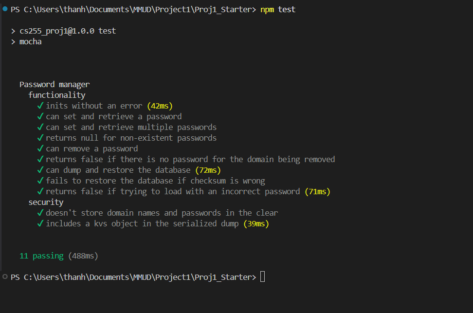
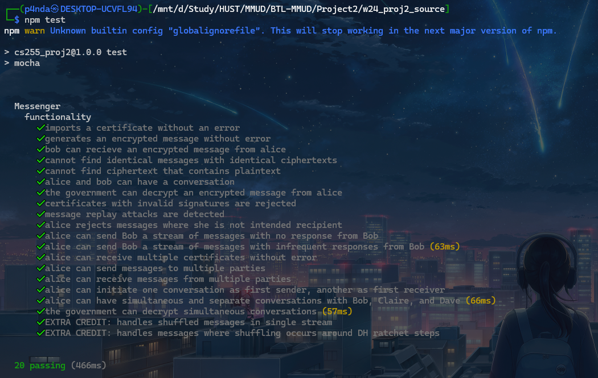

# BTL-MMUD

## Hướng dẫn chạy Project 1
1. Install các thư viện cần thiết 
```bash
cd Project1/Proj1_Starter
npm install
```
2. Chạy với các test có sẵn trong file test
```bash
npm test
```
3. Kết quả thu được


## Hướng dẫn chạy Project 2
1. Install các thư viện cần thiết 
```bash
cd Project2/w24_proj2_source
npm install
```
2. Chạy với các test có sẵn trong file test
```bash
npm test
```
3. Kết quả thu được
